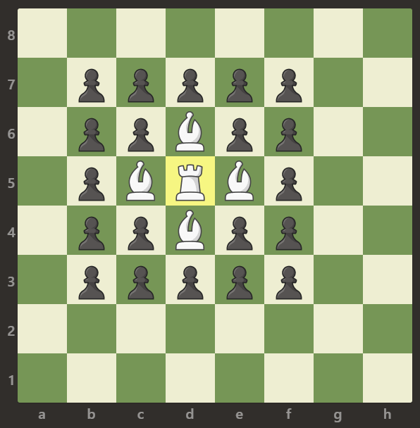
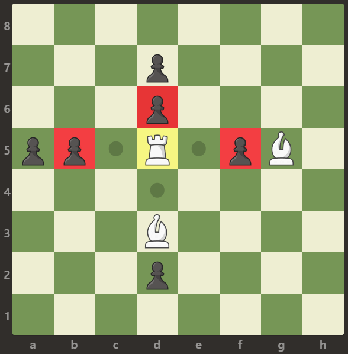

# [Available Captures for Rook](https://leetcode.com/problems/available-captures-for-rook/)
### Summary 
On an 8 x 8 chessboard, there is one white rook.
There also may be empty squares, white bishops, and black pawns.
These are given as characters 'R', '.', 'B', and 'p' respectively.
Uppercase characters represent white pieces,
and lowercase characters represent black pieces.  

The rook moves as in the rules of Chess: it chooses one of four cardinal directions (north, east, west, and south), then moves in that direction until it chooses to stop, reaches the edge of the board, or captures an opposite colored pawn by moving to the same square it occupies.  Also, rooks cannot move into the same square as other friendly bishops.  

Return the number of pawns the rook can capture in one move.

#### Example 1:


    Input: [[".",".",".",".",".",".",".","."],  
           [".",".",".","p",".",".",".","."],  
           [".",".",".","R",".",".",".","p"],  
           [".",".",".",".",".",".",".","."],  
           [".",".",".",".",".",".",".","."],  
           [".",".",".","p",".",".",".","."],  
           [".",".",".",".",".",".",".","."],  
           [".",".",".",".",".",".",".","."]]
    Output: 3
    Explanation: In this example the rook is able to capture all the pawns.

#### Example 2:



    Input: [[".",".",".",".",".",".",".","."],  
           [".","p","p","p","p","p",".","."],  
           [".","p","p","B","p","p",".","."],  
           [".","p","B","R","B","p",".","."],  
           [".","p","p","B","p","p",".","."],  
           [".","p","p","p","p","p",".","."],  
           [".",".",".",".",".",".",".","."],  
           [".",".",".",".",".",".",".","."]]
    Output: 0
    Explanation: Bishops are blocking the rook to capture any pawn.  

#### Example 3:



    Input: [[".",".",".",".",".",".",".","."],  
           [".",".",".","p",".",".",".","."],  
           [".",".",".","p",".",".",".","."],  
           ["p","p",".","R",".","p","B","."],  
           [".",".",".",".",".",".",".","."],  
           [".",".",".","B",".",".",".","."],  
           [".",".",".","p",".",".",".","."],  
           [".",".",".",".",".",".",".","."]]
    Output: 3
    Explanation: The rook can capture the pawns at positions b5, d6 and f5.

#### Note:  
    1. board.length == board[i].length == 8
    2. board[i][j] is either 'R', '.', 'B', or 'p'
    3. There is exactly one cell with board[i][j] == 'R'


## Solution   
```java
    public class AvailableCapturesforRook {
        public int numRookCaptures(char[][] board) {
            int size = 0;
            int ri = 0;
            int rj = 0;
            boolean flag = false;
            int rowLen = board.length;
            int colLen = board[0].length;
    
            for (int i = 0; i < rowLen; i++) {
                for (int j = 0; j < colLen; j++) {
                    if (board[i][j] == 'R') {
                        ri = i;
                        rj = j;
                        flag = true;
                        break;
                    }
                }
                if (flag) {
                    break;
                }
            }
    
            for (int i = ri; i >=0; i--) {
                if (board[i][rj] == 'p') {
                    size++;
                    break;
                } else if (board[i][rj] == 'B') {
                    break;
                }
            }
    
            for (int i = ri; i < rowLen; i++) {
                if (board[i][rj] == 'p') {
                    size++;
                    break;
                } else if (board[i][rj] == 'B') {
                    break;
                }
            }
    
            for (int j = rj; j >= 0; j--) {
                if (board[ri][j] == 'p') {
                    size++;
                    break;
                } else if (board[ri][j] == 'B') {
                    break;
                }
            }
    
            for (int j = rj; j < colLen; j++) {
                if (board[ri][j] == 'p') {
                    size++;
                    break;
                } else if (board[ri][j] == 'B') {
                    break;
                }
            }
            return size;
        }
    }
```  


